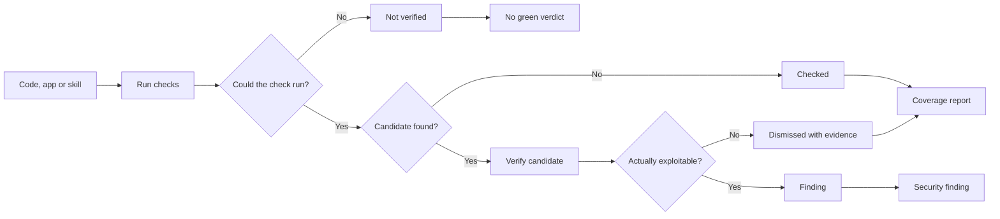
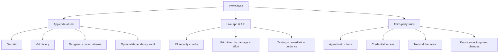
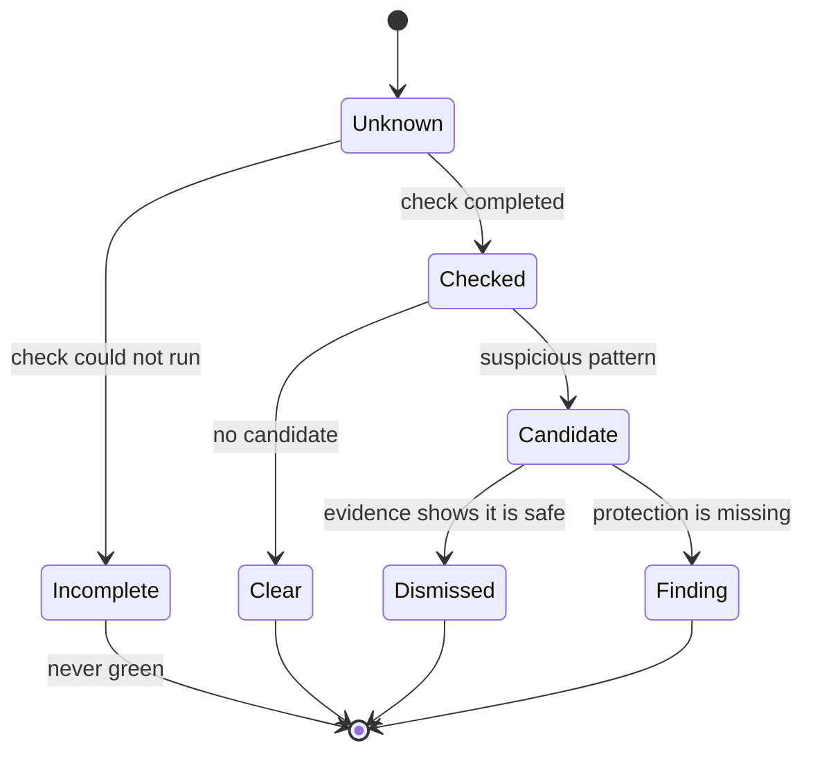
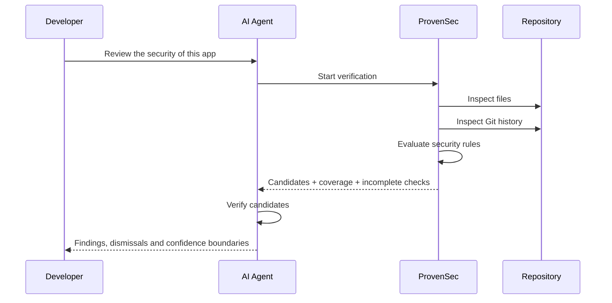
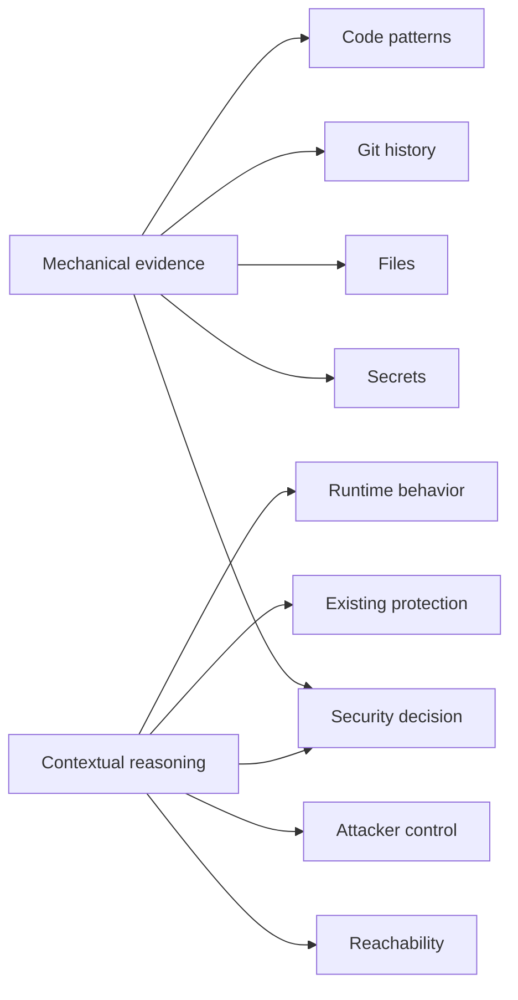

# ProvenSec

> **Not secure until proven.**

Security tooling for AI coding agents built around one simple rule:

**"Secure" is not something an agent should feel. It is something a machine should be able to prove.**

ProvenSec turns security review into an explicit verification process: checks run mechanically where they can, uncertainty stays visible, and anything that was not tested is never presented as safe.

No black-box verdicts. No hidden network calls. No green checkmark for work that never happened.

```text
provensec · app scan  .
2 commits · 2 files · Node and git only, nothing leaves this machine

Coverage
  ✔ Secrets on disk and in history     2 files on disk · 2 commits
  ✔ Dangerous and insecure code        1 code files · text pattern matching, not parsing
  – Vulnerable dependencies            not requested. It sends your package list and versions to the npm registry  → run with --dependencies

Candidates (each goes through verdict.md before it becomes a finding)
  CRITICAL  Live Stripe secret key: moves money. It is in git history: rotate it, deleting the file is not enough
        .env:1 · commit 3665a78c · len 32 · …Rs8t
  CRITICAL  Admin key used in a component that runs in the browser (A02)
        app/api.ts:5
  HIGH  If the variable is missing on the server, the app uses a value written in the code, and anyone who reads the repo has the key (A05)
        app/api.ts:2
  HIGH  Database query built by pasting text. If the text comes from the user, they read or wipe the database (A11)
        app/api.ts:3
  WARNING  HTML inserted straight into the page. If the content comes from users, it runs as script in the viewer's session (A12)
        app/api.ts:4

Verdict
  2 critical · 2 high · 1 warning · 0 info
```

<sub>Real output, on a test repository with a Stripe key committed and later deleted, plus four planted patterns. The key is found through Git history and only its hint is printed.</sub>

---

## The idea

AI coding agents are very good at saying:

> "This looks secure."

The problem is that *looks secure* is not a security state.

A useful security system needs to distinguish between:

* something that was actually checked;
* something that could not be checked;
* something suspicious that still needs a decision;
* and something that was verified and dismissed with evidence.

ProvenSec models those states explicitly.



The important part is not only finding vulnerabilities.

It is knowing **what the system actually knows**.

---

## What ProvenSec covers

ProvenSec approaches security through three tracks:



| Track | Verification | What it looks for |
|---|---|---|
| **App code at rest** | Mechanical | Leaked credentials on disk and across the full Git history, tracked `.env` files, and insecure JavaScript/TypeScript patterns |
| **Live app & API** | Guided verification | 43 checks organized by potential damage and testing effort, each with testing and remediation guidance |
| **Third-party skills** | Mechanical discovery + human decision | Hidden agent instructions, credential reads, outbound data, download-and-execute behavior, hooks, settings changes, persistence and compiled files |

### App code at rest

The scanner checks:

* secrets on disk;
* secrets in the **full Git history**;
* 21 credential formats, including Stripe, AWS, Supabase service role, GitHub, OpenAI and Anthropic;
* tracked `.env` files;
* 14 insecure or dangerous JavaScript and TypeScript patterns;
* dependency vulnerabilities through `npm audit`, **only when explicitly requested**.

### Live application and API

Static analysis cannot prove the behavior of a running system.

For that layer, ProvenSec includes a catalog of **43 security checks**, ordered so that high-impact, low-effort tests come first.

The flow starts with a five-minute private-window test and progressively moves into deeper authorization and application behavior.

### Third-party AI skills

Installing an agent skill means giving code and instructions access to your development environment.

ProvenSec inspects downloaded skills for behavior such as:

* instructions hidden from the user;
* reads of credentials and sensitive folders (`~/.ssh`, Keychain, cloud credential files);
* outbound data transmission;
* download-and-execute behavior;
* hooks;
* settings modification;
* persistence mechanisms;
* compiled or difficult-to-inspect files.

Mechanical checks identify the candidates.

The final decision stays explicit.

---

## The trust model

Most scanners optimize for:

**Did we find something bad?**

ProvenSec also asks:

**Did we actually look?**

That creates a stricter contract.



### A missing check is never green

Examples:

* the repository has no Git history;
* a file could not be read;
* a second test account was unavailable;
* a runtime test could not be performed.

Those conditions are reported by name.

They are not silently converted into success.

### Every candidate starts dismissed

Pattern matching generates hypotheses, not vulnerabilities.

A candidate becomes a finding only when the verification process establishes that:

1. the code can reach production;
2. the attacker controls the relevant input;
3. the expected protection is actually missing.

When a candidate is dismissed, the decision records the file and line that justified it.

This reduces the usual scanner problem of turning every suspicious string into an alarming red warning.

### Secrets are never printed

Detected secrets are reduced to a non-sensitive hint:

```text
len 46 · …a1b2
```

Enough information to identify the credential without reproducing it in logs or agent context.

---

## Local by default

The scanners keep the repository on the machine where they run.

They read local files and Git history without sending source code, diffs or skill contents to an external model or service.

The exception is dependency auditing:

```bash
--dependencies
```

When explicitly enabled, the package information required by `npm audit` is sent to the npm registry.

No dependency audit runs unless you ask for it.

---

## Install

```bash
npx skills add caarloshq/provensec
```

The [skills CLI](https://skills.sh/) installs ProvenSec into supported coding agents, including Claude Code and Codex.

### Claude Code plugin

```text
/plugin marketplace add caarloshq/provensec
/plugin install provensec@provensec
```

Then ask your agent something natural:

```text
Review the security of this app.
```

```text
Did any key leak in this repository?
```

```text
Is this skill safe to install?
```

The agent chooses the appropriate ProvenSec workflow and reports both findings **and coverage**.

---

## How a review works

At a high level:



The result is never a bare:

```text
✓ Secure
```

It is a coverage section that says what ran, what did not and why, followed by candidates that each still need a verdict. That distinction is the product.

---

## Run the scanners directly

You can also run the mechanical layer without an agent.

### App scanner

```bash
node skills/provensec-app/scripts/provensec-app.mjs --dir path/to/app
```

### Skill audit

```bash
node skills/provensec-skill-audit/scripts/scan.mjs path/to/downloaded-skill
```

---

## Exit codes

Exit codes are designed for both humans and automation.

| Exit | App scan | Skill audit |
|---:|---|---|
| `0` | Every requested stage ran and no critical/high candidate remains | Nothing found and every file was read |
| `1` | At least one stage could not fully run: **not a green result** | Invalid folder |
| `2` | Critical or high candidates require review | Candidates require a decision |
| `3` | | Nothing found, but at least one file could not be read: **not a green result** |

This makes ProvenSec usable inside agent workflows and CI-like pipelines without collapsing **unknown** into **safe**.

---

## Designed for agents, useful without them

ProvenSec is intentionally split between what software can prove mechanically and what still needs contextual reasoning.



The scripts handle deterministic evidence.

The agent handles context.

Neither layer gets to pretend it performed the other one's job.

---

## What ProvenSec intentionally does not do

ProvenSec is not trying to replace a full security platform.

The app scanner uses **line-by-line text pattern matching**, not an AST parser or full data-flow engine.

That means it can:

* flag code that is actually safe;
* miss equivalent vulnerabilities written differently.

That is why scanner output is treated as a **candidate list**, not an automatic vulnerability verdict.

Current boundaries:

* 21 credential formats rather than the hundreds supported by dedicated secret scanners;
* JavaScript and TypeScript code rules only;
* dependency scanning is opt-in;
* some runtime checks require manual execution and application context.

Dedicated testing guides are bundled for:

* IDOR;
* function-level authorization.

Mass assignment, race conditions, business logic, JWT and CSRF testing link to the original guides from [Strix](https://github.com/usestrix/strix).

The remaining catalog items include their testing instructions directly in the catalog.

---

## Servers

Server hardening is intentionally outside this repository.

For VPS security, use [`@onovoprogramador/onp-security-vps`](https://www.npmjs.com/package/@onovoprogramador/onp-security-vps).

It follows a similar verification-first philosophy while keeping infrastructure concerns separate from application and agent-skill security.

---

## Tested rules

Every app scanning rule has automated tests: one case it must flag and one it must not.

```bash
node skills/provensec-app/scripts/rules.test.mjs
```

```text
70 cases · 0 failure(s) · 0 rule(s) without a test case
```

---

## Design principles

ProvenSec is built around a few constraints that shape the whole system:

**Evidence over confidence.**
A confident agent response is not proof.

**Unknown is a real state.**
Something that could not be checked stays unknown.

**Candidates are not findings.**
Pattern matching generates things to investigate, not automatic verdicts.

**Coverage is part of the result.**
A security report should explain what it did *and did not* inspect.

**Local first.**
Security tooling should not create another path for source code or credentials to leave the machine.

**Machines verify what machines can verify.**
Judgment is reserved for the parts that genuinely require context.

---

## Credits

ProvenSec builds on ideas and material from:

* [Strix](https://github.com/usestrix/strix)
* [Trail of Bits](https://github.com/trailofbits/skills)
* [VibeSec](https://github.com/BehiSecc/VibeSec-Skill)
* [NVIDIA SkillSpector](https://github.com/NVIDIA/SkillSpector)

See [`THIRD_PARTY.md`](THIRD_PARTY.md) for attribution and licensing details.

---

## License

MIT. See [`LICENSE`](LICENSE).

Guides adapted from Strix remain under Apache 2.0.
